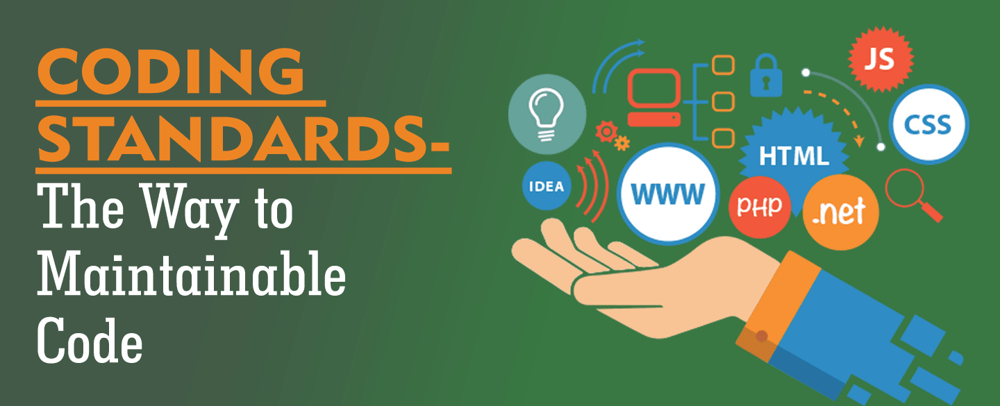

## Fall 2019
This semester was an experience that I'll always remember. I took ICS 314 at UH Manoa, with the idea that I'm going to improve my skills as a computer scientist. Not only did the class do exactly that, it gave me knowledge on how to be a professional in this field. I learned how to set my schedule to put enough time on projects. Going into the class, I had no prior experience to software engineering, it was like I was entering this new world and I had to explore it. I was lost at first, but as the semester aged I was able to get on track. This experience from this class is one that I can rely on if I'm working on a project in the future. I was given some pointers on how to succeed. Some of the things that really resonated with me during this course are Ethics in Software Engineering and Coding Standards. 

## Coding Standards

## Ethics in Software Engineering

