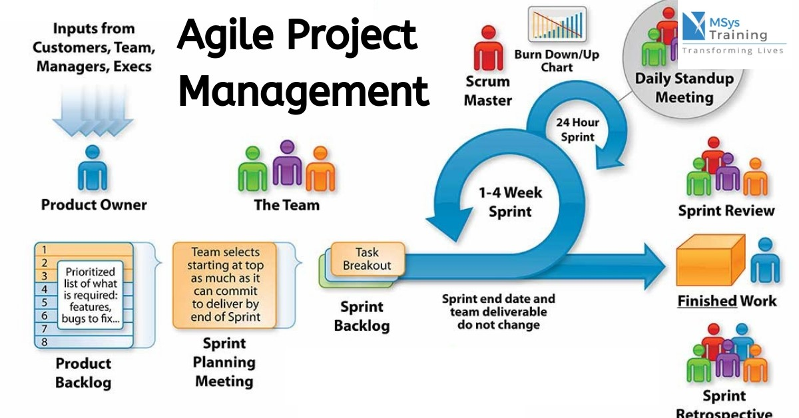

## Fall 2019
This semester was an experience that I'll always remember. I took ICS 314 at UH Manoa, with the idea that I'm going to improve my skills as a computer scientist. Not only did the class do exactly that, it gave me knowledge on how to be a professional in this field. I learned how to set my schedule to put enough time on projects. Going into the class, I had no prior experience to software engineering, it was like I was entering this new world and I had to explore it. I was lost at first, but as the semester aged I was able to get on track. This experience from this class is one that I can rely on if I'm working on a project in the future. I was given some pointers on how to succeed. Some of the things that really resonated with me during this course are Ethics in Software Engineering and Coding Standards. 

## Coding Standards
Coding Standards are guidelines, habits, and programming styles that every developer must abide by when writing source code for a project. When you follow coding standards, it is a lot easier for other collaborators to read your work. Think of just typing a paper for a class, there is a certain format you must follow for example, how you categorize your paragraphs (intro, body, conclusion). The intro must come before the body paragraphs and the conclusion comes after that. If you mix up the order of your paragraphs then your essay becomes incredibly difficult to read and eventually readers lose interest. The same thing can be applied to coding. If you're code looks clustered with poor spacing and endless amounts of if statements, collaborators will take issue to that. In the past, I've had people tell me that they couldn't answer my questions because of how poorly my code was written. It's like the tech-version of bad handwriting, if they can't read your writing, how do you expect them to help you. Not following coding standards also holds your group back when working on a project. If you have errors and your code does not follow proper standards, it could take hours upon hours to find the error. To be an effective programmer, you need to have good coding habits, and following coding standards is the first step. You don't want to be that person who turns in sloppy work.

 

## Agile Project Management
Agile Project Management is a very efficient way of project management. It allows groups to break up the whole project into smaller sub-projects. These sub-projects are then finished in shorter amounts of time. This process is called Issue Driven Project Management (IDPM). For example, the final project for ICS 314 was divided into 3 milestones. For each milestone, there were a set of tasks that needed to be completed in order to satisfy the Milestone requirements. This style of project management is very efficient in the fact that the smaller sup-projects add up to create the overall project. It's like the more bites of the apple you take, the more likely you are to finish the apple. APM also promotes a team-working environment where everyone is held accountable for the portion of the work. There are really no roles of power because everyone has the same amount of work to do and also the ability to create new issues and assign those issues to others. 

