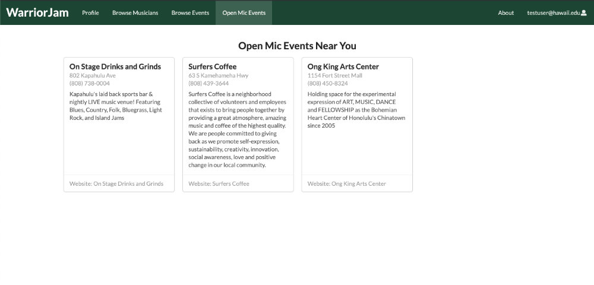
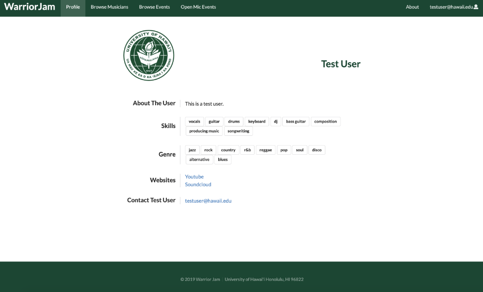

### Warrior Jam App 
*Home Page*

## What is Warrior Jam?
Many UH students have musical talents, but there is no easy way for them to find others with similar tastes and compatible musical abilities. Thus, they cannot experience the fun of informal jam sessions which could progress into performing musical groups.

WarriorJam is a web application that will help UH students (and staff) have their musical talents, and interests be discovered by other people with similar interests. The app will give you the opportunity to share your music content (YouTube, SoundCloud, etc.) By using our website, you can find and meet different people who have the same goals as you do. Who knows? You could be the next member of a band like Coldplay, Pink Floyd, Queen, and many more.

*Events Page*

*User Page*

## Contributions to the Project
In this project, my main objectives were to create the Landing Page, Sign-In/Sign-Out Pages, and the Navigation Menu. Other things that I felt contributed to the project were suggesting ideas on the website, identifying issues, assigning tasks on github, and assisting group members that were stuck. 

## Takeaways from this Project
As a team, I feel that we have gained experience of what it's like in a working environment. For myself, I've gained valuable experience of what it's like working on a team. Overall, I feel that I put a good amount of effort into the project. What's most important is that I gained an understanding of how I can apply my knowledge of Javascript, HTML/CSS, Semantic UI React to solving real world problems. 

## Where can I find this project?
To view our organization page, click [here](https://github.com/warrior-jam/warrior-jam)
